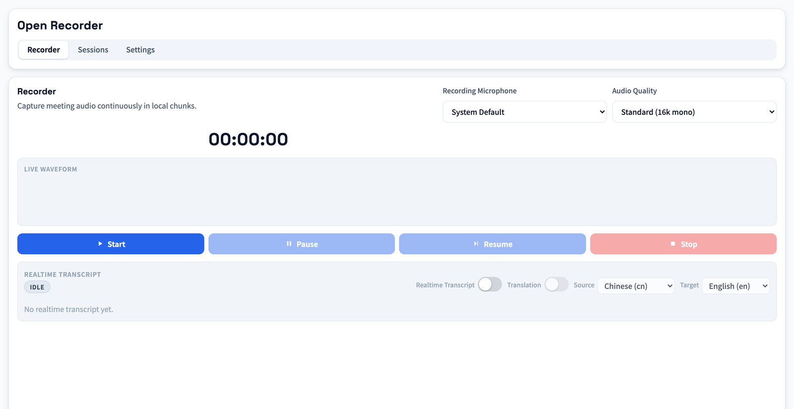

<p align="center">
  
</p>

<h1 align="center">Open Recorder</h1>

<p align="center">
  A local-first desktop recording app with transcription and AI-powered meeting summaries.
</p>

<p align="center">
  <a href="./README.zh-CN.md">简体中文</a> ·
  <a href="#features">Features</a> ·
  <a href="#installation">Installation</a> ·
  <a href="#getting-started">Getting Started</a> ·
  <a href="#configuration">Configuration</a> ·
  <a href="#faq">FAQ</a>
</p>

<p align="center">
  
  
  
</p>

## Screenshot



---

## Features

### 🎙️ Recording
- **Continuous local recording** — audio is automatically sliced into 2-minute segments
- **Input device selection** — choose between system default or a specific microphone; device is locked during recording to prevent mid-session switching
- **Selectable audio quality**:
  - Standard (16 kHz mono)
  - HD (24 kHz mono)
  - Hi-Fi (48 kHz stereo)
- **Live waveform visualization** — real-time display of duration, RMS, and peak levels
- **Import audio files** — create sessions from existing audio files (wav, m4a, mp3, aac, flac, ogg, opus, webm, mp4, m4b)

### 📝 Transcription
- **Multiple transcription providers**:
  - **Bailian** (百炼) — Alibaba Cloud DashScope
  - **Aliyun Tingwu** (听悟) — offline task-based transcription
  - **Local STT** — Whisper / SenseVoiceSmall with optional speaker diarization
- **Realtime transcription** via Aliyun Tingwu WebSocket, with auto-reconnect on network failure (every 5s, up to 3 retries)
- **Realtime translation** — translate recognized speech into multiple target languages in real time

### 📋 AI Summary
- **Multiple summary providers**:
  - **Bailian** — Chat Completions compatible
  - **OpenRouter** — Chat Completions, access 100+ models
- **Customizable prompt templates** — define system/user prompts with variables
- **Structured output** — title, decisions, action items, risks, timeline, and raw Markdown

### 📦 Export
- **Export audio** in M4A or MP3 format (segments are merged before export)
- **Copy summary** to clipboard in one click

### 🌐 Multi-language UI
- Built-in support for **English** and **简体中文**
- Switch languages from Settings > General

### ☁️ Cloud Storage (OSS) Integration
- Upload audio to cloud for transcription
- Supports **Aliyun OSS** and **Cloudflare R2** (S3-compatible)
- Multiple OSS configurations with an active selection

---

## Tech Stack

| Layer | Technology |
|-------|-----------|
| Framework | [Tauri v2](https://v2.tauri.app/) |
| Frontend | React 19 + TypeScript + Vite |
| Backend | Rust (recording, storage, transcription & summary logic) |
| Audio | [cpal](https://crates.io/crates/cpal) + [hound](https://crates.io/crates/hound) + ffmpeg |

---

## Installation

### Download Pre-built Binary

> 🚧 Pre-built binaries are coming soon. For now, please build from source.

### Build from Source

#### Prerequisites

| Dependency | Version | Notes |
|-----------|---------|-------|
| [Node.js](https://nodejs.org/) | 20+ | Frontend build |
| [Rust](https://rustup.rs/) | Latest stable | Backend build |
| [Tauri CLI](https://v2.tauri.app/start/prerequisites/) | v2 | Installed via npm devDependencies |
| [ffmpeg](https://ffmpeg.org/) | Any recent | Required for MP3 export and audio merging |

On macOS, you can install ffmpeg via Homebrew:
```bash
brew install ffmpeg
```

#### Build Steps

```bash
# Clone the repository
git clone https://github.com/mtotozy-create/open-recorder.git
cd open-recorder

# Install frontend dependencies
npm install

# Run in development mode
npm run tauri:dev

# Or build a production release
npm run tauri:build
```

The built `.app` bundle is located at:
```
src-tauri/target/release/bundle/macos/Open Recorder.app
```

---

## Getting Started

### 1. Record

1. Open the app and navigate to the **Recorder** tab.
2. Select your preferred microphone (or keep "System Default").
3. Choose an audio quality preset.
4. Click **Start** to begin recording. Audio is saved locally in 2-minute segments.
5. Click **Stop** when finished. A new session is automatically created.

### 2. Transcribe

1. Go to the **Sessions** tab and select a session.
2. Click **Run Transcription**.
3. The app will merge audio segments (if needed), upload to your configured OSS (for cloud providers), and submit for transcription.
4. Results appear in the **Transcription & Summary** tab.

### 3. Generate Summary

1. After transcription is complete, click **Generate Summary**.
2. Choose a summary template (optional).
3. An AI-generated meeting summary will appear with structured fields (decisions, action items, risks, timeline).
4. Click **Copy** to copy the summary to clipboard.

### 4. Export Audio

- In the session detail, use **Export M4A** or **Export MP3** to export the merged recording.

### 5. Import Audio Files

- In the **Sessions** tab, click **New Session** to create a session from an existing audio file.
- Supported formats: wav, m4a, mp3, aac, flac, ogg, opus, webm, mp4, m4b.

---

## Configuration

All settings are available under the **Settings** tab, organized into sections:

### General

| Setting | Description |
|---------|-------------|
| Language | UI language (English / 中文) |
| Recording Segment Length | Duration per audio segment (default: 120s) |
| Microphone | Select input device for recording |

### Provider

Configure the AI service providers used for transcription and summary:

#### Bailian (百炼)

| Field | Default | Description |
|-------|---------|-------------|
| API Key | — | DashScope API key |
| Base URL | `https://dashscope.aliyuncs.com` | API endpoint |
| Transcription Model | `paraformer-v2` | Speech-to-text model |
| Summary Model | `qwen-plus` | LLM for meeting summary |

#### Aliyun Tingwu (听悟)

| Field | Default | Description |
|-------|---------|-------------|
| AccessKey ID / Secret | — | Alibaba Cloud credentials |
| AppKey | — | Tingwu application key |
| Endpoint | `https://tingwu.cn-beijing.aliyuncs.com` | API endpoint |
| Source Language | `cn` | `cn` / `en` / `yue` / `ja` / `ko` / `multilingual` |
| Speaker Diarization | Disabled | Identify individual speakers |
| Poll Interval | 60s | Query interval for offline tasks (60–300s) |
| Max Polling Time | 30min | Max wait for task completion (5–720min) |

Realtime transcription reconnects automatically on WebSocket disconnection (5s interval, max 3 retries).

#### OpenRouter (Summary only)

| Field | Default | Description |
|-------|---------|-------------|
| API Key | — | OpenRouter API key |
| Base URL | `https://openrouter.ai/api/v1` | API endpoint |
| Summary Model | `qwen/qwen-plus` | LLM model identifier |

#### Local STT

| Field | Default | Description |
|-------|---------|-------------|
| Engine | `whisper` | `whisper` or `sensevoice_small` |
| Whisper Model | `small` | `small` / `medium` / `large-v3` |
| Language | `auto` | `auto` / `zh` / `en` |
| Speaker Diarization | Disabled | Speaker separation (pyannote) |
| Compute Device | `auto` | `auto` / `cpu` / `mps` / `cuda` |
| Python Path | — | Path to Python ≥ 3.10 interpreter |
| Venv Directory | — | Virtual environment directory |
| Model Cache Directory | — | Where to cache downloaded models |

### OSS (Object Storage)

You can configure **multiple OSS** entries and select which one is active. Cloud-based transcription providers upload audio to the active OSS.

| Field | Description |
|-------|-------------|
| OSS Provider | `aliyun` or `r2` (Cloudflare R2) |
| AccessKey ID / Secret | Storage credentials |
| Endpoint | `https://oss-cn-beijing.aliyuncs.com` (Aliyun) or `https://<accountid>.r2.cloudflarestorage.com` (R2) |
| Bucket | Storage bucket name |
| Path Prefix | Upload path prefix (default: `open-recorder`) |
| Signed URL TTL | Pre-signed URL expiration in seconds (60–86400) |

### Templates

Manage reusable summary prompt templates:

- **Template ID / Name** — unique identifier and display name
- **System Prompt** — LLM system instructions
- **User Prompt** — prompt template with `{variable}` placeholders
- **Variables** — comma-separated list of available variables
- **Default Template** — set a template as the default for new summaries

---

## Data Storage

All data is stored locally. The app resolves the data directory in this order:

1. `OPEN_RECORDER_DATA_DIR` environment variable (if set)
2. `~/Library/Application Support/Open Recorder` (macOS)
3. `~/.open-recorder-data`
4. `<project_dir>/.open-recorder-data`
5. System temp directory → `open-recorder-data`

### Directory Structure

```
<data-dir>/
├── state.json                          # Sessions, tasks, settings
├── audio/<session_id>/segments/        # Audio segments (WAV chunks)
└── exports/<session_id>/              # Exported / merged audio files
```

---

## FAQ

### "selected OSS config ... is incomplete"
Your active OSS configuration is missing required fields (AccessKey ID/Secret, Endpoint, or Bucket). Go to **Settings > OSS** and fill in all required fields.

### "provider ... requires API key"
The selected transcription or summary provider has no API key configured. Go to **Settings > Provider** and enter your API key.

### "session is still processing segments"
Recording just stopped and audio post-processing is still running. Wait a moment and retry transcription or export.

### "failed to run ffmpeg for export"
`ffmpeg` is not installed or not in your system PATH. Install it:
```bash
# macOS
brew install ffmpeg
```

### "realtime websocket disconnected; retried every 5 seconds for 3 times but still failed"
The Aliyun Tingwu realtime transcription WebSocket couldn't reconnect after 3 attempts. Check:
- Network connectivity
- Aliyun AccessKey ID/Secret and AppKey configuration
- Service availability

### Where can I see task error details?
- **In the app**: Open a session → go to the **Tasks** tab
- **In the data file**: Check `state.json` → `jobs.<jobId>.error`

---

## Development

### NPM Scripts

| Script | Description |
|--------|-------------|
| `npm run dev` | Start Vite dev server (frontend only) |
| `npm run build` | Build frontend static assets |
| `npm run preview` | Preview frontend build output |
| `npm run tauri:dev` | Start Tauri desktop dev mode |
| `npm run tauri:build` | Build Tauri desktop app |
| `npm run version:sync` | Sync version from `package.json` to Tauri/Cargo/README badges |
| `npm run version:check` | Check whether version files are synchronized |
| `npm run release:dry` | Preview next release version and changelog (no file changes) |
| `npm run release` | Interactive release (SemVer + Conventional Commits, includes one `tauri:build`) |
| `npm run release:patch` | Non-interactive patch release (includes one `tauri:build`) |
| `npm run release:minor` | Non-interactive minor release (includes one `tauri:build`) |
| `npm run release:major` | Non-interactive major release (includes one `tauri:build`) |

### Project Structure

```
open-recorder/
├── src/                        # Frontend (React + TypeScript)
│   ├── components/             # UI components
│   │   ├── RecorderTab.tsx     # Recording interface
│   │   ├── SessionsTab.tsx     # Session management
│   │   ├── SettingsTab.tsx     # Settings panel
│   │   └── TabNav.tsx          # Navigation tabs
│   ├── i18n/                   # Internationalization
│   ├── lib/                    # Utilities
│   ├── types/                  # TypeScript type definitions
│   ├── App.tsx                 # Main application
│   └── styles.css              # Global styles
├── src-tauri/                  # Backend (Rust)
│   ├── src/
│   │   ├── commands/           # Tauri command handlers
│   │   ├── providers/          # Transcription/Summary/OSS providers
│   │   ├── models.rs           # Data models & domain types
│   │   ├── storage.rs          # Local file storage
│   │   └── state.rs            # Application state management
│   └── tauri.conf.json         # Tauri configuration
└── package.json
```

---

## Contributing

Contributions are welcome! Please feel free to submit a Pull Request.

1. Fork the repository
2. Create your feature branch (`git checkout -b feature/amazing-feature`)
3. Commit your changes (`git commit -m 'feat: add amazing feature'`)
4. Push to the branch (`git push origin feature/amazing-feature`)
5. Open a Pull Request

---

## License

This project is licensed under the [MIT License](LICENSE).

---

<p align="center">
  Made with ❤️ by <a href="https://github.com/mtotozy-create">mtotozy-create</a>
</p>
